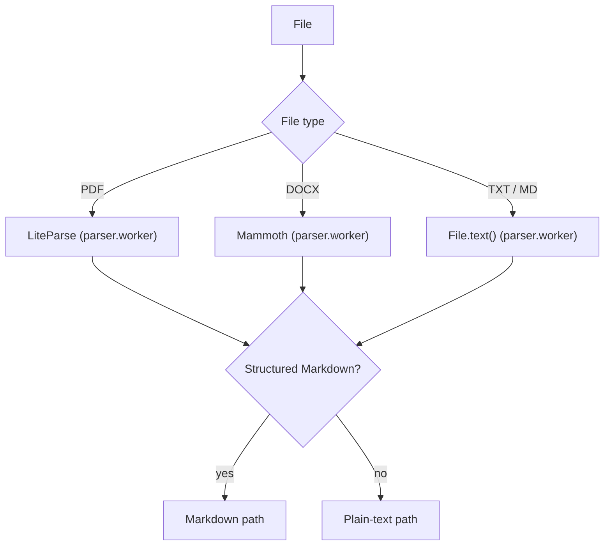
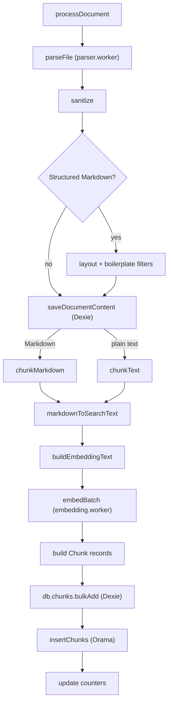

# Document Ingestion Pipeline

**Scope.** This document describes only the processing that happens once a
document starts being processed: from `processDocument`
(`src/services/ingest/ingest.service.ts`) until the document reaches the
`indexed` status. It does not cover file upload, drag & drop, or how the
processing queue is created.

## 1. Parser selection

`parseFile` (`src/services/ingest/parser.service.ts`) decides how to extract
text based on the file type. The actual extraction happens in the parser worker
(`src/workers/parser.worker.ts`), except for reading the text file itself,
which uses `File.text()`. The extraction result determines the downstream path:
structured Markdown (PDF, MD) or plain text (TXT, DOCX).

| Format    | Parser in `parser.worker.ts`       | Output                            | Path            |
| --------- | ---------------------------------- | --------------------------------- | --------------- |
| PDF       | LiteParse (WASM/PDFium)            | Structured Markdown               | Markdown path   |
| DOCX      | Mammoth `extractRawText`           | Plain text (structure discarded)  | Plain-text path |
| TXT / MD  | `File.text()` + `parseText`        | Text as-is (`.md` keeps Markdown) | MD → Markdown path, TXT → plain-text path |

The "structured Markdown?" check (`docMeta.type === 'pdf'` or a `.md` /
`.markdown` file name) selects the Markdown path — structured filters plus
`chunkMarkdown` — while TXT and DOCX take the plain-text path — `chunkText`
with no structural filters.

## 2. End-to-end flow

The real order of the pipeline in `processDocument` is: parse, sanitize,
filters (Markdown path only), save the document content, chunk, embed, persist
chunks, index into Orama, and update counters.

The only thing that distinguishes the two paths is the structural treatment:

- **Structured Markdown (PDF, MD)**: the text passes through the malformed
  layout filter and the boilerplate filter, and is chunked with
  `chunkMarkdown`.
- **Plain text (TXT, DOCX)**: the structural filters are skipped and the text
  is chunked with `chunkText`.

Both paths share the rest of the pipeline: `saveDocumentContent` stores the
document's **full, already-filtered text** (Markdown for PDF/MD, plain text for
TXT/DOCX), both chunking functions produce each chunk's `searchText` via
`markdownToSearchText`, and from there the flow (embeddings → chunks → Dexie →
Orama) is identical.

Each stage writes a document status to Dexie, and progress is reported as a
percentage range:

| Status      | Stage                                                    | Progress |
| ----------- | -------------------------------------------------------- | -------- |
| `parsing`   | `parseFile` → parser worker (LiteParse / Mammoth / text) | 0–10 %   |
| `chunking`  | filters, `saveDocumentContent`, `chunkMarkdown`/`chunkText` | 10–15 % |
| `embedding` | `buildEmbeddingText`, `embedBatch`                       | 15–90 %  |
| `indexed`   | persist chunks, Orama insert, update counters            | 90–100 % |

`saveDocumentContent` stores the full document text: filtered Markdown for
PDF/MD, sanitized plain text for TXT/DOCX. `markdownToSearchText` runs on both
paths (stripping Markdown syntax and URLs; on plain text it acts as
normalization / a pass-through). `buildEmbeddingText` composes the embedding
input from `sectionPath` + `searchText`, and each stored `Chunk` record holds
`text`, `searchText`, `sectionPath`, `headingText`, and `embedding`.

## 3. Responsibilities per service

| File                                                     | Main function                              | Responsibility                                                                                   |
| -------------------------------------------------------- | ------------------------------------------ | ------------------------------------------------------------------------------------------------ |
| `src/services/ingest/ingest.service.ts`                  | `processDocument`                          | Orchestrates the whole pipeline and updates status/progress                                      |
| `src/services/ingest/parser.service.ts`                  | `parseFile`                                | Dispatches the file to the right parser via the worker                                           |
| `src/workers/parser.worker.ts`                           | `parsePdf` / `parseDocx` / `parseText`     | Actual extraction: LiteParse (PDF → Markdown), Mammoth (DOCX → raw text), text pass-through      |
| `src/services/ingest/sanitize.service.ts`                | `sanitize`                                 | Conservative normalization (NFKC, invisible characters, whitespace) without touching structure   |
| `src/services/ingest/malformed-layout-filter.service.ts` | `filterMalformedLayoutBlocks`              | Removes malformed sidebar/infobox blocks (structured Markdown only)                              |
| `src/services/ingest/section-filter.service.ts`          | `filterBoilerplateSections`                | Removes boilerplate sections (References, Bibliography, …) (structured Markdown only)           |
| `src/services/ingest/chunking.service.ts`                | `chunkMarkdown` / `chunkText`              | Chunks the text and produces each chunk's `text` + `searchText`; both call `markdownToSearchText` |
| `src/services/ingest/markdown-to-search-text.service.ts` | `markdownToSearchText`                     | Generates the `searchText` (retrieval representation) used by both chunking paths                |
| `src/services/embedding/embedding.service.ts`            | `embedBatch`                               | Comlink proxy to the embedding worker                                                            |
| `src/workers/embedding.worker.ts`                        | `generateEmbeddings`                       | Generates vectors with the HuggingFace ONNX model (`Xenova/all-MiniLM-L6-v2`)                    |
| `src/services/embedding/vector-store.ts`                 | `insertChunks`                             | Maintains the Orama index (one per library)                                                      |
| `src/services/document.service.ts`                       | `saveDocumentContent` / `updateDocumentStatus` | Stores the document's full (filtered) text and status changes                                  |
| `src/infrastructure/db.ts`                               | `db` (Dexie)                               | Persistent table definitions: `documents`, `documentContents`, `chunks`, `libraries`             |

## 4. Why DOCX stays plain text

`parser.worker.ts` extracts DOCX content with Mammoth's `extractRawText`,
which intentionally discards the document structure: headings, lists, and
tables all collapse into a flat text stream. That is why DOCX joins the
plain-text path instead of the Markdown path.

Converting DOCX to Markdown is possible, but it is **not a trivial one-line
change** if the goal is to preserve headings, lists, and tables: it would
require extracting structured output from Mammoth (e.g. `convertToHtml`) or
from the DOCX format itself, and then converting that structure into Markdown.
Designing and validating that conversion is a separate effort, so it is
**out of the current ingestion scope**.

## 5. The two representations of a chunk

Every chunk stored in Dexie holds two texts with different purposes, plus its
section metadata and its `embedding` vector:

- **`text`**: the source/display representation of the chunk — the filtered
  Markdown for PDF/MD, or the plain text for TXT/DOCX. It is used to **render
  the document and highlight matches** in the viewer, because it preserves the
  original structure.
- **`searchText`**: the retrieval representation, generated with
  `markdownToSearchText` (both `chunkMarkdown` and `chunkText` apply it to
  every chunk). On Markdown it strips syntax and URLs; on plain text it acts
  as normalization / a pass-through. This is the representation consumed by
  **search** (BM25 in Orama) and the base of the **embedding**.

Each chunk also carries section metadata: `sectionPath` (the heading
hierarchy, e.g. `["Introduction", "Methods"]`) and `headingText` (the
immediately preceding heading). The text sent to the embedding model is
composed by `buildEmbeddingText`: `sectionPath` joined with `" > "` followed by
the `searchText`, so the vector includes the section context.

## 6. Persistence and indexing

- **Dexie (IndexedDB) is the source of truth**: the document's full content
  (`documentContents`, holding the filtered text written by
  `saveDocumentContent`), metadata and status (`documents`), and the chunks
  with their `text`, `searchText`, metadata, and embedding (`chunks`).
- **Orama is a derived in-memory index**, one per library
  (`Map<libraryId, AnyOrama>`). It only accelerates hybrid search and can be
  rebuilt from Dexie at any time; it is never the origin of the data.

## 7. Error path

The whole of `processDocument` is wrapped in a `try/catch`. Any exception
during processing (for example, "No text could be extracted from document"
when no chunk is produced) updates the document in Dexie with the `error`
status, stores the error message in the `error` field, and clears
`processingProgress`. The remaining documents in the queue continue processing.
